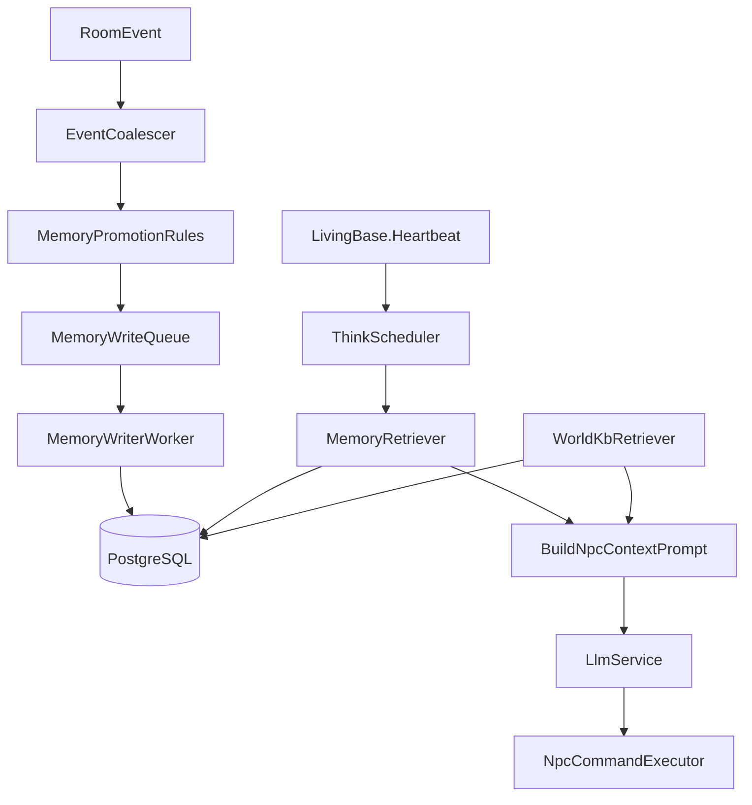

# Per-NPC Goals + Long-Term Memory (Postgres + pgvector)

## Objectives
- Persist **per-NPC goals** and **per-NPC long-term memory** across server restarts.
- Add a **shared world knowledge base** (read-mostly for NPCs) alongside per-NPC memory.
- Support **multiple game server processes** sharing the same PostgreSQL database.
- Keep runtime stable with **hard budgets**: bounded writes, bounded retrieval, bounded LLM calls.

## Non-goals (for this milestone)
- Full sharded world simulation across servers (cross-server room presence, routing events between servers).
- Storing full chat transcripts; long-term memory is summaries/facts.

## Architecture



### Key components to add
- **`INpcMemoryStore`** ✅: read/write per-NPC memories (`Mud/AI/INpcMemoryStore.cs`, `Mud/AI/PostgresNpcMemoryStore.cs`).
- **`IWorldKnowledgeBase`** ✅: shared KB (`Mud/AI/IWorldKnowledgeBase.cs`, `Mud/AI/PostgresWorldKnowledgeBase.cs`). (Policy: NPCs should be read-only; wizard/system writes only.)
- **`INpcGoalStore`** ✅: persist per-NPC goals (`Mud/AI/INpcGoalStore.cs`, `Mud/AI/PostgresNpcGoalStore.cs`).
- **`INpcNeedStore`** ✅: persist per-NPC needs/drives (`Mud/AI/INpcNeedStore.cs`, `Mud/AI/PostgresNpcNeedStore.cs`).
- **`MemoryWriteQueue` + background writer** ✅: bounded in-process queue with DropOldest (`Mud/AI/NpcMemorySystem.cs`).
- **`ThinkScheduler`** (planned): global budgeting for LLM calls and memory retrieval.

## Data model (Postgres + pgvector)

### Installing pgvector (Windows)
- If you're running PostgreSQL on Windows and want vector search, follow `docs/PGVECTOR_WINDOWS.md` (based on: https://dev.to/mehmetakar/install-pgvector-on-windows-6gl).

### Tables
- **`npc_goals`** (small, frequently updated) ✅ **Updated for stackable goals**
  - `npc_id` (text) — part of composite PK
  - `goal_type` (text) — part of composite PK
  - `target_player` (text, nullable) — stable account/player name (normalized)
  - `params` (jsonb)
  - `status` (enum/text)
  - `importance` (int, default 50) — priority level (1=highest/survival, 50=default, 100=background)
  - `updated_at`
  - **PRIMARY KEY (npc_id, goal_type)** — allows multiple goals per NPC

- **`npc_needs`** (small, frequently updated) ✅
  - `npc_id` (text) — part of composite PK
  - `need_type` (text) — part of composite PK (e.g. `survive`)
  - `level` (int, default 1) — priority level (1 = top need)
  - `params` (jsonb)
  - `status` (text)
  - `updated_at`
  - **PRIMARY KEY (npc_id, need_type)** — allows multiple needs per NPC

- **`npc_memories`** (append-mostly)
  - `id` (uuid PK)
  - `npc_id` (text)
  - `subject_player` (text, nullable) — stable account/player name
  - `room_id` / `area_id` (text, nullable)
  - `kind` (text) — `dialogue_summary`, `trade`, `combat`, `preference`, `quest`, …
  - `importance` (0–100)
  - `tags` (text[])
  - `content` (text, bounded in app)
  - `created_at`, `expires_at`
  - `embedding` (vector(N), nullable)

- **`world_kb`** (shared KB)
  - `key` (text PK)
  - `value` (jsonb)
  - `tags` (text[])
  - `visibility` (`public|system|wizard`)
  - `updated_at`

### Indices
- `npc_goals (npc_id, importance ASC)` — for priority-ordered retrieval
- `npc_goals (target_player)` — for player-focused queries
- `npc_memories (npc_id, created_at desc)`
- `npc_memories (npc_id, subject_player, created_at desc)`
- GIN on `npc_memories.tags` and `world_kb.tags`
- pgvector index on `npc_memories.embedding` (HNSW or IVFFlat)

### Current implementation notes
- Schema/extension initialization runs at startup (idempotent) via `Mud/AI/PostgresMemorySchema.cs`.
- If `CREATE EXTENSION vector` fails due to permissions, the driver continues without vector support.
- Embeddings are stored as nullable; if `EmbeddingModel` is not configured, memories are stored without vectors.
- When embeddings are enabled, they are generated asynchronously in the background writer loop (non-blocking).

### Embedding configuration ✅ IMPLEMENTED
- **Embedding model** is configured in `appsettings.json` under `Llm.EmbeddingModel` (e.g., `mxbai-embed-large:latest`)
- **Dimensions** must match in `Memory.EmbeddingDimensions` (e.g., 1024 for mxbai-embed-large)
- Embeddings are generated **asynchronously** in the background writer loop via `ILlmService.EmbedAsync()`
- If embedding fails or is disabled, memories are stored without vectors (falls back to importance/recency)

| Embedding Model | Dimensions | Ollama Install |
|----------------|------------|----------------|
| `mxbai-embed-large` | 1024 | `ollama pull mxbai-embed-large` |
| `nomic-embed-text` | 768 | `ollama pull nomic-embed-text` |
| `all-minilm` | 384 | `ollama pull all-minilm` |

**Key files:**
- `ILlmService.EmbedAsync()` — embedding interface method
- `OllamaLlmService.EmbedAsync()` — Ollama `/api/embed` implementation
- `NpcMemorySystem.MemoryWriterLoopAsync()` — generates embeddings before storage
- `NpcMemorySystem.EmbedQueryAsync()` — helper for query embedding

## Memory semantics

### Memory layers
- **Working**: existing `RoomEventLog` + small per-NPC RAM ring buffer.
- **Short-term persistent**: keep in `IStateStore` (e.g., engagement + relationship counters).
- **Long-term persistent**: `npc_memories` + `world_kb`.

### Promotion rules (write policy)
Add a rules engine that decides whether an observed event becomes long-term memory:
- **Always promote** (as structured fact + short summary):
  - trade completed / buy / sell
  - quest accepted / completed / refused
  - combat started / killed / fled
  - repeated preference detected (e.g., “likes swords”)
  - direct insult/threat/theft
- **Never promote**:
  - ambient chatter not addressed to NPC
  - arrivals/departures unless they matter to a goal

### Summarization
- After an interaction ends (no directed speech for X seconds), write **one** `dialogue_summary` entry.
- Keep summary bounded (e.g., 512–1024 chars).

### Retention and pruning
- Enforce per-NPC caps:
  - max entries (e.g., 10k)
  - max content bytes (e.g., 1–5 MB)
- Prune oldest low-importance first.
- TTL for low-importance memories (days/weeks); never-expire for high-importance.

## Retrieval (bounded + fast)

### Candidate selection
For a think cycle, retrieve at most:
- **K_mem = 8–15** per-NPC memories
- **K_kb = 3–8** KB facts

### Two-stage retrieval (recommended)
1. Metadata filter in SQL (npc_id + subject_player + TTL) returning last ~500 by recency.
2. Rerank with pgvector similarity to the current “query embedding” (built from event + goal + room).

### Query identity
- Use **stable player account name** (normalized) as `subject_player`.
- Derive `subject_player` from `RoomEvent.ActorName` and/or `Session.PlayerName`.

## Goals system (per NPC) ✅ IMPLEMENTED

### Representation
- Goal = (npc_id, goal_type, target_player?, params, status, **importance**)
- Goals are **stackable** — each NPC can have multiple goals with different types
- Goals are **prioritized** by importance (lower number = higher priority)
- Plan = bounded queue of steps (max 3–5) stored in `params.plan` (json array) or kept ephemeral.

### Importance levels (GoalImportance constants)
| Level | Constant | Description |
|-------|----------|-------------|
| 1 | `Survival` | Highest priority — auto-set for all living entities |
| 5 | `Combat` | Active combat situations |
| 10 | `Urgent` | Urgent tasks |
| 50 | `Default` | Normal priority (default for LLM-set goals) |
| 100 | `Background` | Low priority background tasks |

### Three ways to set goals
1. **Source code** — Implement `IHasDefaultGoal` interface with `DefaultGoalType`, `DefaultGoalImportance`
2. **LLM markup** — `[goal:type]`, `[goal:type target]`, `[goal:clear]`, `[goal:done type]`
3. **Wizard command** — `goal <npc> [type [importance] [target]]`

### Goal completion
Goals are LLM-driven completion — the NPC decides when a goal is done by outputting:
- `[goal:done type]` — marks specific goal complete (clears it)
- `[goal:clear type]` — removes specific goal
- `[goal:clear]` — clears all goals (except survival)

### Goal restoration ✅ IMPLEMENTED
When a goal is cleared or completed:
1. System checks if the NPC implements `IHasDefaultGoal`
2. If the cleared goal matches the `DefaultGoalType`, it is automatically restored
3. This enables cyclical goals (e.g., shopkeeper sells item → goal restored → ready for next sale)
4. NPCs always maintain their default motivation even after completing tasks
5. Non-default goals (e.g., player-targeted goals) are not auto-restored

### Goal plans ✅ IMPLEMENTED
Goals can have step-by-step plans that NPCs work through to achieve the goal.

**Data model:**
- Plans stored in goal's `params` JSONB field as `{plan: {steps: [...], currentStep: N, completedSteps: [...]}}`
- `GoalPlan` class provides parsing, step advancement, and serialization

**NPC system prompt instructions:** ✅ ADDED
NPCs are now instructed about plan markup in their system prompt via `LivingBase.BuildSystemPrompt()`:
```
Plan Management:
- Create a plan for your current goal: [plan:step1|step2|step3]
- Steps are separated by | (pipe character)
- Mark current step complete: [step:done] or [step:complete]
- Skip current step: [step:skip] or [step:next]
- Example: [plan:find customer|show wares|negotiate price|complete sale]
- Plans help you break down goals into actionable steps
```

**LLM markup:**
- `[plan:step1|step2|step3]` — set plan for highest priority goal
- `[step:done]` — complete current step, advance to next
- `[step:skip]` — skip current step without completing

**Wizard commands:**
- `goal <npc> plan <type> <step1|step2|...>` — set plan
- `goal <npc> plan <type> clear` — clear plan

**LLM context display:**
Goals with plans show: `[50] sell_items (step 2/4: "show_items")`

**Auto-completion:**
When all plan steps are completed, the goal is automatically cleared and default goal restored if applicable.

**Key files:**
- `World/std/living.cs` — `BuildSystemPrompt()` includes Plan Management section
- `Mud/AI/GoalPlan.cs` — Plan data model and step management
- `Mud/AI/INpcGoalStore.cs` — `UpdateParamsAsync` for plan updates
- `Mud/AI/NpcCommandExecutor.cs` — Plan/step markup parsing

## Needs/Drives system (per NPC) ✅ IMPLEMENTED

### Representation
- Need = (npc_id, need_type, level, status, params)
- Needs are **always-on** — they never complete (unlike goals)
- Needs are **prioritized** by level (lower number = higher priority)
- Shown to LLM as "Drives" in the NPC context

### Level constants (NeedLevel)
| Level | Constant | Description |
|-------|----------|-------------|
| 1 | `Survival` | Auto-applied to all living entities |
| 2 | `Primary` | Core motivation (e.g., hunt for predators) |
| 3 | `Secondary` | Important but not core (e.g., rest) |
| 4 | `Tertiary` | Nice to have |
| 5 | `Background` | Lowest priority |

### Two ways to set needs

1. **Source code** — Implement `IHasDefaultNeeds` interface:
```csharp
public sealed class Cat : MonsterBase, ILlmNpc, IHasDefaultGoal, IHasDefaultNeeds
{
    public IReadOnlyList<(string NeedType, int Level)> DefaultNeeds => new[]
    {
        ("hunt", NeedLevel.Primary),
        ("rest", NeedLevel.Secondary)
    };
}
```

2. **Programmatically** — Via `IMudContext` methods:
   - `SetNeedAsync(needType, level, status)` — set/update need
   - `ClearNeedAsync(needType)` — clear specific need
   - `GetAllNeedsAsync()` — get all needs ordered by level

### Key differences from goals
- **Goals** = completable tasks (e.g., "sell item to customer")
- **Needs** = ongoing drives that never complete (e.g., "maintain_shop", "hunt")
- Goals support LLM markup for completion; needs are persistent
- Both are provided to LLM as context for decision-making

### Execution
- Fast loop: rule-based progression each heartbeat.
- Slow loop: LLM used only to:
  - produce dialogue content
  - propose plan steps when a goal is created or blocked

## Multi-server considerations

### DB as the shared source of truth
- All processes read/write goals and memories to the same Postgres.

### Concurrency and idempotency
- Memory writes should be idempotent where possible (e.g., include a deterministic `source_event_id` for events you promote).
- Use transactional inserts.

### LLM budget
- Enforce global “LLM calls/sec” per process and a per-NPC cooldown.
- Optional later: a distributed budget (Redis) — not required initially.

## Implementation steps (files and modules)

### 1) Add storage layer abstractions ✅
- Add interfaces:
  - `Mud/AI/INpcMemoryStore.cs`
  - `Mud/AI/IWorldKnowledgeBase.cs`
  - `Mud/AI/INpcGoalStore.cs`
- Add implementations:
  - `Mud/AI/PostgresNpcMemoryStore.cs`
  - `Mud/AI/PostgresWorldKnowledgeBase.cs`
  - `Mud/AI/PostgresNpcGoalStore.cs`

### 2) Add background write pipeline ✅
- `Mud/AI/NpcMemorySystem.cs` — bounded channel + background writer in single class

Integrate startup/shutdown wiring in:
- `Mud/Network/GameServer.cs`
- `Program.cs` / settings in `appsettings.json`

### 3) Add promotion rules ✅
- `Mud/AI/MemoryPromotionRules.cs` (pure functions)
- Integrate event hooks:
  - `NpcCommandExecutor` already records events; add promotion on key actions.
  - Add promotion from combat outcomes in combat scheduler path.

Target files:
- `Mud/AI/NpcCommandExecutor.cs`
- `Mud/CombatScheduler.cs` (or wherever deaths/combat results are finalized)

### 4) Add retrieval into NPC prompt building ✅
- Extend NPC prompt assembly in `LivingBase.ProcessLlmEventNow` path to fetch:
  - top-K per-NPC memories for `(npcId, subject_player)`
  - top-K KB facts for room/area tags

Target files:
- `World/std/living.cs`
- `Mud/MudContext.cs` (optional helper methods)

### 5) Add directed-speech detection + engagement ✅
- Add alias support for livings and engagement state (`engaged_with_player`, TTL) in `IStateStore`.

Target files:
- `World/std/living.cs` — `IsEngagedWith()`, `EngageWith()`, `DisengageFrom()`, `IsSpeechDirectlyAddressed()`
- `Mud/Commands/Navigation/LookCommand.cs`
- `Mud/Commands/Inventory/GiveCommand.cs`
- `Mud/AI/NpcCommandExecutor.cs`

### 6) Add DB migrations and configuration ✅
- Migrations strategy: idempotent SQL on startup via `PostgresMemorySchema.cs`

Add config section:
- `Memory: { ConnectionString, UsePgVector, EmbeddingModel, MaxWritesPerSecond, ... }`

Files:
- `Mud/Configuration/DriverSettings.cs`
- `Mud/Configuration/MemorySettings.cs`
- `appsettings.json`

### 7) Add wizard/system commands to manage world KB ✅
- Added wizard-only command `kb` with subcommands:
  - `kb get <key>` — retrieve entry by key
  - `kb set <key> <json> [tags...]` — create/update entry
  - `kb search <tag1> [tag2...]` — search by tags
  - `kb delete <key>` — delete entry

Files:
- `Mud/Commands/Wizard/KbCommand.cs`

### 8) Tests and load checks
- Unit tests:
  - promotion rules
  - retrieval ranking
  - pruning logic
- Integration tests:
  - memory persisted across restart

Files:
- `JitRealm.Tests/*`

## Observability

### LLM Debug Logging ✅ IMPLEMENTED
File-based debug logging for real-time monitoring of LLM operations.

**Configuration (`appsettings.json`):**
```json
"Llm": {
  "DebugEnabled": true,
  "DebugLogPath": "llm_debug.log",
  "DebugVerbose": false
}
```

**Key files:**
- `Mud/AI/LlmDebugLogger.cs` — Logger class with auto-flush file output
- `Mud/WorldState.cs` — `LlmDebugger` property
- `Mud/MudContext.cs` — Logs requests, responses, and context stats
- `Mud/AI/NpcCommandExecutor.cs` — Logs command execution and goal changes

**Log entry types:**
| Type | Description |
|------|-------------|
| `REQUEST` | LLM prompts (NPC ID, event info, prompt sizes) |
| `RESPONSE` | LLM responses with timing (ms) |
| `CONTEXT` | Memory/goal/need/KB retrieval counts |
| `COMMAND` | NPC command execution (OK/FAILED) |
| `GOAL` | Goal set/cleared/restored_default |
| `MEMORY` | Memory operations |
| `EVENT` | Room event processing |

**Usage:** `tail -f llm_debug.log`

### Metrics (planned)
- Add counters:
  - memory writes/sec, queue depth
  - retrieval latency
  - LLM calls/sec, LLM latency
  - prune runs and rows removed
- Emit into existing metrics system (`LoopMetrics`) or a new `AiMetrics`.

## Rollout plan
- Stage 1: Postgres store + no vectors (still write embeddings null) + tag/recency retrieval. ✅
- Stage 1b: Stackable goals with importance-based priority + three-way goal setting + wizard `goal` command. ✅
- Stage 1c: NPC needs/drives system with `IHasDefaultNeeds` interface + `NeedLevel` constants. ✅
- Stage 2: Enable pgvector extension + embeddings + similarity rerank. ✅
  - Added `EmbeddingModel` config to `LlmSettings`
  - Added `ILlmService.EmbedAsync()` + Ollama `/api/embed` implementation
  - Embeddings generated asynchronously in `NpcMemorySystem.MemoryWriterLoopAsync()`
  - Added `NpcMemorySystem.EmbedQueryAsync()` for query embedding
- Stage 2b: LLM debug logging for development and troubleshooting. ✅
  - `LlmDebugLogger` class with file-based auto-flush logging
  - Logs requests, responses, timing, context stats, commands, and goal changes
  - Configurable via `Llm.DebugEnabled`, `DebugLogPath`, `DebugVerbose`
- Stage 2c: Goal planning with step-by-step tasks. ✅
  - `GoalPlan` class for plan data model and step management
  - LLM markup: `[plan:step1|step2|...]`, `[step:done]`, `[step:skip]`
  - Wizard command: `goal <npc> plan <type> <steps>`
  - Plans shown in LLM context with current step
  - Auto-completion when all steps done
- Stage 3: Add memory summarization and more advanced planning.
- Stage 4: GraphRAG — combine vector search with knowledge graphs for relationship-aware retrieval.

## Risks and mitigations
- **DB write amplification**: mitigate with promotion rules + batching + queue.
- **Prompt bloat**: strict top-K and char caps.
- **Multi-server concurrency**: idempotency keys for promoted events, transactional writes.
- **Privacy/poisoning**: NPCs never write to `world_kb`; only wizard/system writes.

